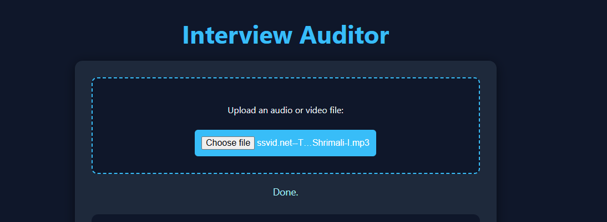
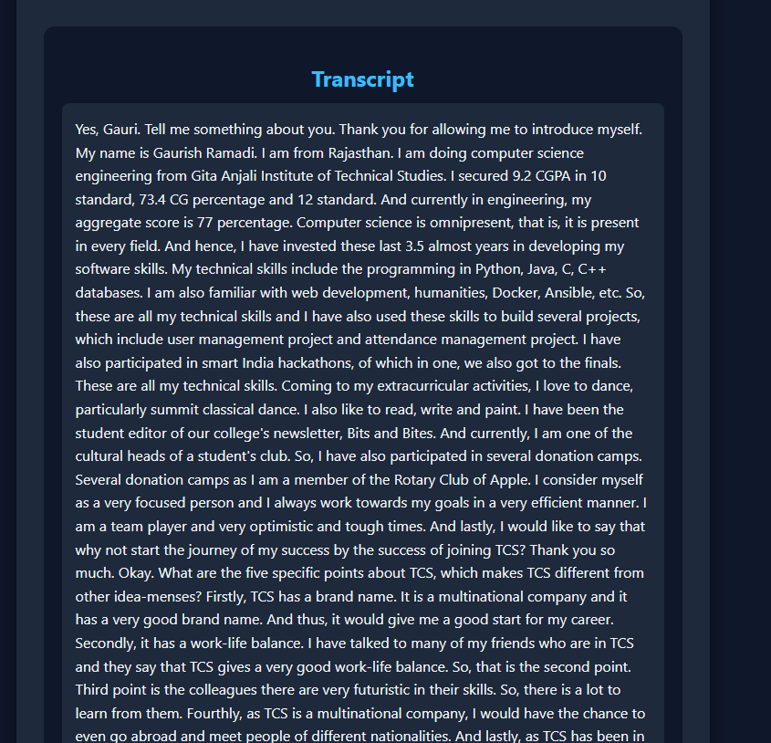

🎤 Interview Auditor – AI-based Cheating Detection in Interviews
✅ Overview

Interview Auditor is a FastAPI + HTML/JS based web tool designed to detect the likelihood of AI-generated answers during interviews. It takes an audio or video file, extracts speech, converts it into text using OpenAI Whisper, and then analyzes the text for AI likeness using metrics like perplexity, burstiness, and repetition.

This project helps interviewers determine whether the candidate's responses are human-generated or influenced by AI tools (like ChatGPT).

🚀 Features

✔ Upload audio or video files.
✔ Automatic speech-to-text conversion using Whisper.
✔ AI-likeness analysis with a score (0–100).
✔ Displays transcript of the audio.
✔ Simple, clean web interface.

🛠 Tech Stack

Backend: FastAPI (Python), Uvicorn

Frontend: HTML, CSS, JavaScript (Fetch API)

AI Models:

Speech-to-Text: Faster-Whisper (Whisper optimized)

AI Detection: Custom algorithm using text metrics

Libraries: fastapi, uvicorn, faster-whisper, onnxruntime, pydantic, etc.

📂 Project Structure
interview_cheat_detection/
│
├── app/
│   ├── main.py              # FastAPI backend code
│   ├── requirements.txt     # All dependencies
│   └── .venv/               # Virtual environment (ignored in .gitignore)
│
├── frontend/
│   └── index.html           # Web interface
│
├── .gitignore               # Ignore unnecessary files
└── README.md                # Project documentation

⚙️ Installation & Setup
1️⃣ Clone the Repository
git clone https://github.com/yourusername/interview_cheat_detection.git
cd interview_cheat_detection

2️⃣ Create Virtual Environment
cd app
python -m venv .venv

Activate it:

Windows PowerShell:

.venv\Scripts\Activate.ps1

Mac/Linux:

source .venv/bin/activate

3️⃣ Install Dependencies
pip install -r requirements.txt

4️⃣ Run the Backend Server
uvicorn app.main:app --reload

The API will run at: http://127.0.0.1:8000

5️⃣ Open the Frontend

Open frontend/index.html in your browser.

Upload an audio/video file and check the results.

🖼 Screenshot

🔍 How it Works?

User uploads an audio/video file.

Backend extracts audio (if video) and runs Whisper to get text.

Text is analyzed for AI-likeness using metrics like:

Perplexity – How predictable the text is.

Burstiness – Sentence variation.

Repetition Rate – How much text repeats.

Final AI Likelihood Score (0-100) is displayed.

✅ Future Scope

Video Analysis with Eye Detection:
Future versions will include real-time eye-tracking and face analysis to detect if candidates are looking away frequently (e.g., reading AI answers).

Live Interview Monitoring:
Implement real-time transcription & analysis during live interviews.

More Advanced AI Detection Models:
Integrate large-scale AI text detection tools for improved accuracy.

📜 License

This project is open-source under the MIT License.

🔥 Star this repo if you like it! ⭐